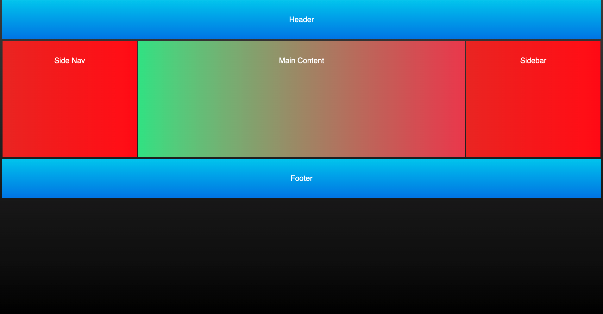

# CSS-Holy-Grail

## Description
This is a mini project I made to practice styling with CSS. I used flex-box and other CSS properties to create the "Holy Grail" layout design.

## Elements
** This mini project is for practicing and familiarizing myself with different ways to design a webpage. It includes the html semantic elements listed below.
```
header
main (nav, article, aside)
footer

```

# GitHub Pages:

## Mock-Up
The following image shows the web application's appearance

